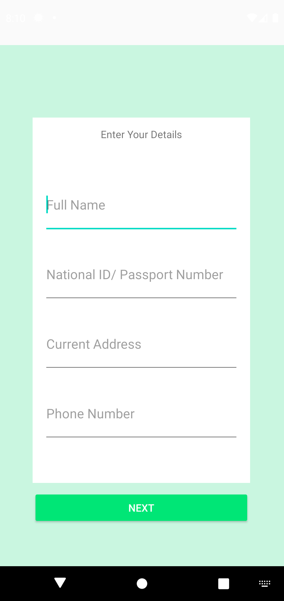
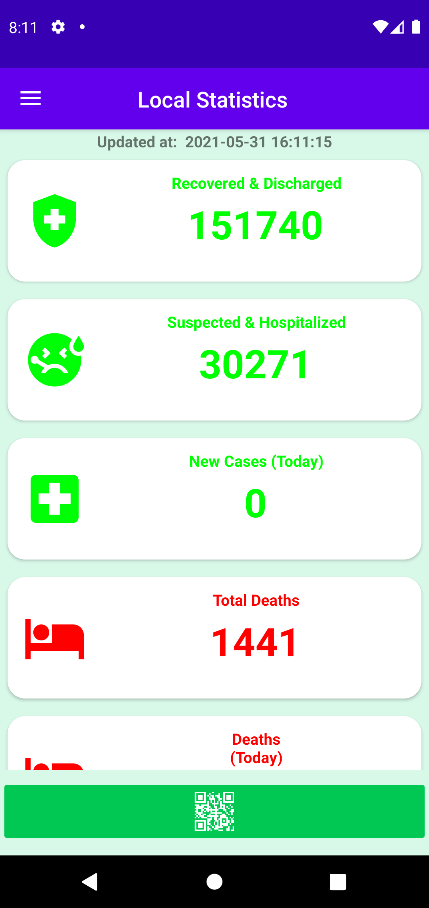
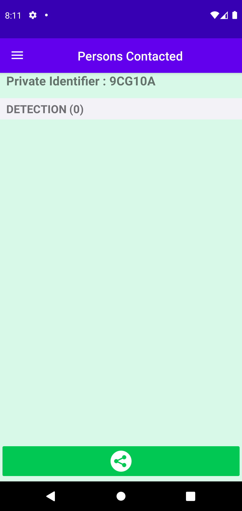
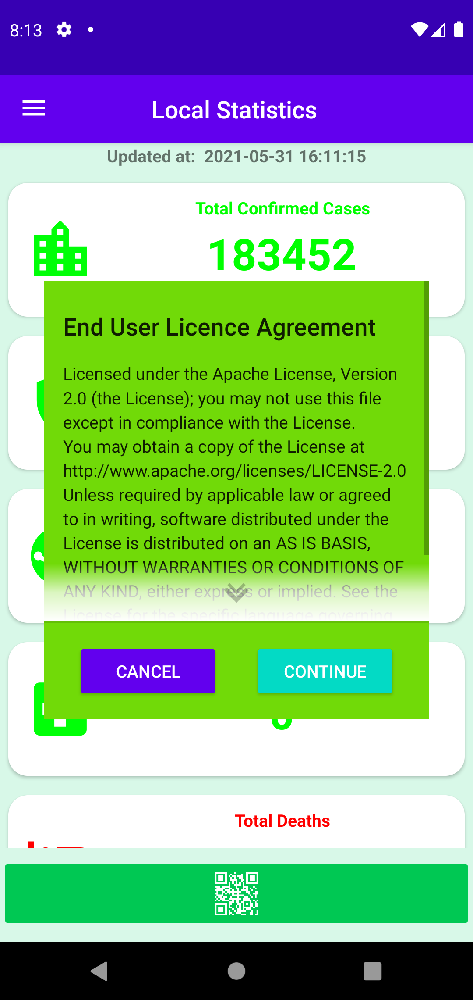
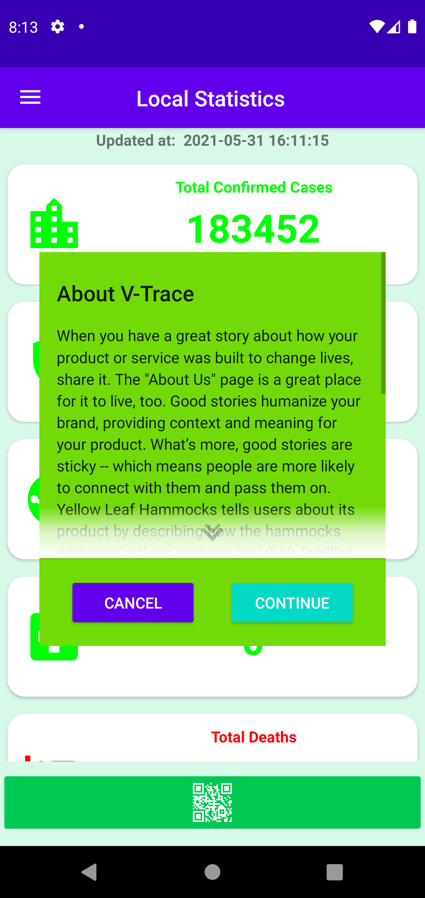

## Interface
        

## How tracing works

Continuous proximity detection across Android devices in background for contact tracing and infection control according to epidemiology requirements. 

See LICENSE.txt and NOTICE.txt for Herald protocol details.

## Introduction

This solution will:

- Operate on 97.5% of phones worldwide without requiring a software update.
- Detect 100% Android devices within 8 metres for contact tracing.
- Measure distance between devices at least once every 30 seconds for infection risk estimation.

## Key features

- API Based on the Herald Protocol by 2020-2021 Herald Project Contributors. [The Herald Project](https://heraldprox.io/)
- Works on the vast majority of phones worldwide (97.5%) by minimising operating system and hardware requirements (Statcounter, 2020).
- Fully operational as a background app on Android devices for consistent and continuous use to maximise disease transmission monitoring and control across the population.
- Low power usage (circa 2% per hour) to maximise population acceptance for continuous use.
- Detection and identification of Android devices in both foreground and background modes is 100% to maximise contact tracing coverage. 
- One or more distance measurement per 30 second window for devices within epidemiologically relevant range (8 metres) for accurate infection risk estimation and case isolation; coverage is > 99.5% of 30 second windows for 2 to 3 devices, and 93% - 96% of windows for 9 to 10 devices.
- RSSI measurements for distance estimation is 98.5% accurate within epidemiologically relevant range (8 metres).
- Device identification payload agnostic to support both centralised, and decentralised approaches, as well as retrospective integration into existing solutions.
- Apache-2.0 licensed and open source for ease of integration, reuse and transparency.

## Hardware requirements

- Operating system

  - Android 5.0+, tested up to Android 10.0 (API level 29).

- Hardware
- 
  - Android phones with BLE, including phones that do not support BLE advertising.

## Quick start

A procedure for installing and testing the solution in background mode is as follows:

1. Clone Android repos in Android Studio or preferred IDE.
2. Build, deploy and run test app on Android devices with Bluetooth OFF.
3. Allow test app to access Bluetooth and Location, move app to background, and lock test devices.
4. Switch Bluetooth ON while devices are locked and app is in background to start test.
5. Place devices within 8 metres of each other and wait for 10 to 30 minutes.
6. Switch Bluetooth OFF while devices are locked and app is in the background to end test.
7. Open app on each device to quickly check other devices were detected and most recent detection time.
8. Download plain text CSV log data files from each device for detailed analysis.

## Installation

The proximity detection solution has been integrated into a standalone app on Android. The app will detect, identify and measure distance for all Android devices within detection range, present the results on a simple user interface, and also write the results to local device storage for download and analysis.

### Android app installation

1. Open Android Studio.
2. Select menu item *VCS > Git > Clone* to clone the Android repo as a new project.
3. Add your own Firebase `google-services.json` file to project root folder (App uses firestore to save login details).
4. Add your google Maps API key to `"Your API Key"` in `app/src/main/AndroidManifest.xml`
5. Select menu item *File > Sync Project with Gradle Files* to show both *app* and *herald* modules.
6. Select menu item *Build > Make Project* to build *app* and *herald* modules.
7. Enable Developer Mode on Android phone (*Settings > About > Software > Tap Build number repeatedly*).
8. Connect Android phone to computer with USB cable, select device in Android Studio (PC emulator lacks bluetooth module required for application to function).
9. Select menu item *Run > Run 'app'* to build and deploy test app.
10. Expect the test app to open on the device.

### Android app log files

1. Install and open Android File Transfer utility (https://www.android.com/filetransfer/)
2. Connect Android phone to computer with USB cable, unlock device, ensuring USB Preferences is set to "File transfer".
3. Open Android File Transfer utility.
4. Select path *Android / media / com.vmware.herald.app / Sensor*.
5. Expect a list of log files (e.g. *contacts.csv*).
6. Drag and drop to copy log files to computer for analysis.

### All contributions are welcome! 

Bug fixes and code optimiztions are in need!
